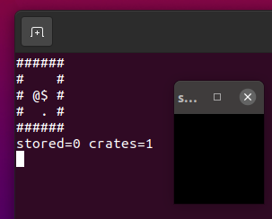

# sokolban
[![Build Status][VWorkflowBadge]][WorkflowUrl]

Sokoban in V using Sokol/TUI, just 4fun



# Try it
```
$ v run sokolban.v
```

[VWorkflowBadge]: https://github.com/nsauzede/sokolban/workflows/V/badge.svg
[WorkflowUrl]: https://github.com/nsauzede/sokolban/commits/main
